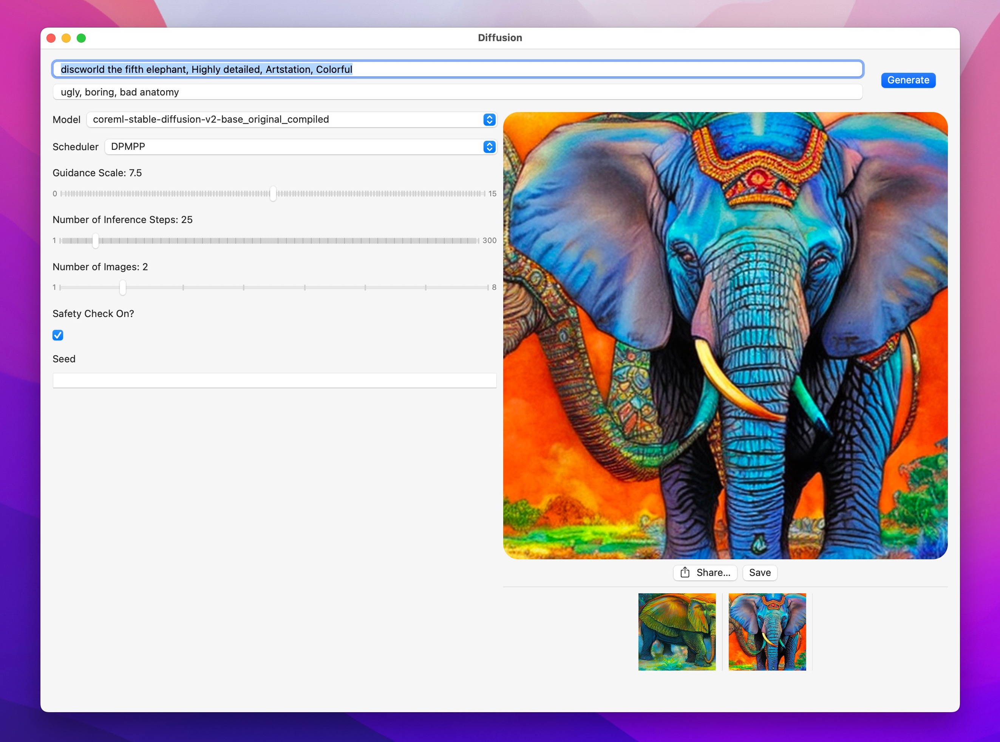

#  Diffusion

This app integrates Apple's [Core ML Stable Diffusion implementation](https://github.com/apple/ml-stable-diffusion) in a native Swift UI application. It can be used for simple image generation, or as a test platform for trying out new features and functionality. You'd have to compile the code yourself though since there is no binary release — but compiling the code should be fairly straightforward since everything is self-contained 🙂

This is what it looks like:

## Installing

### The Project

The Xcode project has been set up in such a way that you can clone the repo, set up your configuration once and then continue to use it (and pull updates and/or submit pull requests) without your local signing configuration needing to be fixed each time.

The project uses xcconfig files to implement this. You just need to make a copy of the `Sign-Debug-template.xcconfig` and `Sign-Release-template.xcconfig` files and name them `Sign-Debug.xcconfig` and `Sign-Release.xcconfig` respectively.

You then need to create two manual provisioning profiles (Xcode will not accept automatically created profiles for this purpose) and insert the relevant values from them into the newly created files. You also need to set your own bundle identier (for the `PRODUCT_BUNDLE_IDENTIFIER` key) to the file so that code signing will let you use your own bundle ID.

(I will add more detailed documentation here as to how to do all of this when I have a bit of time but a little bit of Googling should show you how to create a manual provisioning profile and to get the values from the provisioing profile you created 🙂)

### Model Data

The app does not pull model data from anywhere — it simply expects the model data to be in separate folders (for each supported model) under your `Documents` folder under the sub-folder structure of `Diffusion\models`. You would need to create these folder and download the models you want from Hugging Face (https://huggingface.co/apple).

The app has the loaded model hardcode to `coreml-stable-diffusion-v1-5_original_compiled`. You can change this to the correct model folder depending on how you want to name/organize things.

The plan is to add the ability to switch between multiple modesl by selecting the model you want from the models folder. But this is not in place at the moment.

## Compatibility

- macOS Ventura 13.1, iOS/iPadOS 16.2, Xcode 14.2.
- Performance (after initial generation, which is slower)
  * ~10s in macOS on MacBook Pro M1 Max (64 GB).
  * ~2 minutes in iPhone 13 Pro.

## Limitations

- ~~The UI does not expose a way to configure the scheduler, number of inference steps, or generation seed. These are all available in the underlying code.~~
- ~~A single model (Stable Diffusion v1.5) is considered.~~ 
- The Core ML compute units have been hardcoded to CPU and GPU, since that's what gives best results on my Mac (M1 Max MacBook Pro).
- Sometimes generation returns a `nil` image. This needs to be investigated.

## Next Steps

- ~~Improve UI. Allow the user to select generation parameters.~~
- ~~Implement negative prompts.~~
- Implement other interesting schedulers.
- ~~Allow other models to run.~~ 
- Provide a recommended "compute units" configuration based on model and platform.
- Explore other features (image to image, for example)

## Credit

For faster inference, the project uses a very fast scheduler: [DPM-Solver++](https://github.com/LuChengTHU/dpm-solver) that was ported to Swift by the Hugging Face team/[Pedro Cuenca](https://github.com/pcuenca/). Since this scheduler is still not available in Apple's GitHub repository, the application depends on the following fork instead: https://github.com/pcuenca/ml-stable-diffusion. The Swift port is based on [Diffusers' DPMSolverMultistepScheduler](https://github.com/huggingface/diffusers/blob/main/src/diffusers/schedulers/scheduling_dpmsolver_multistep.py), with a number of simplifications.

